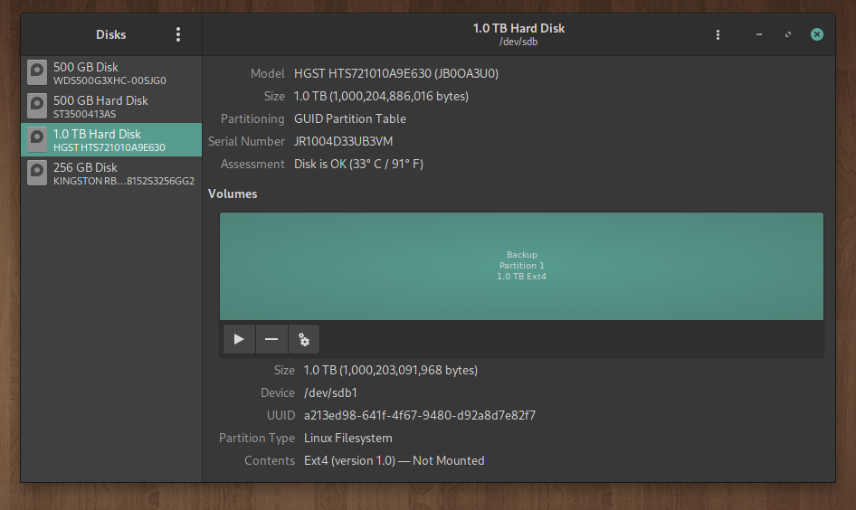
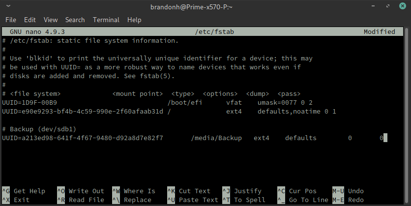

In many Linux distributions, non-boot drives are not mounted when you boot into the system. They mount when you open them, but it is helpful in many cases to already have the drive mounted when you first boot up your machine. For example, if you have a separate Steam or media library on a drive, some applications may need access to the data before you can manually mount the drives.

This was originally a section on the 5 MUST DO Tasks after Installing Manjaro article, but it needs more of a deep dive as it could apply to any distribution.

https://youtu.be/LkwZZIsY9uE

**Warning: Doing this requires editing the fstab file in the /etc/ be careful while doing this. Mistakes may cause boot or other issues. We will make a backup later.**

## Identifying the Disk

There are two ways to do this: through a GUI disk manager on your system or through the terminal. I recommend using the terminal, but it’s always good to double-check on a disk manager such as Disks, KDE Partition Manager, or GParted.

To do this through a program, you can open the ‘Disks’ utility and identify the drive. You’ll want to find the Device, UUID, and the type of file system. For example, I will be mounting my backup drive.



**Removable Media: Mounting removable storage such as USB’s SD cards etc in fstab will result in an un-bootable system if the removable storage isn’t present and connected at boot time.**

Finding the device information though the terminal is very easy and in most cases preferred to using software.

Find the fdisk list command to see all drives and their partitions.

```
sudo fdisk -l
```

The blkid command allows you to display information about available block devices. This will allow you to view the filesystem type, UUID, labels, and more.

```
sudo blkid
```


## Editing the fstab file

Now that you know your disk UUID, we will create the mounting directory. You can do this almost anywhere, but it is common practice to do this in the /media folder. Type the following command, replacing “Backup” with the label of your preference.

```
sudo mkdir /media/Backup
```

Now, we will back up our fstab file so that we can restore it to the original in case something goes wrong. First, we will navigate to the directory and then create a copy with a backup extension.

```
cd /etc/fstab
```

```
sudo cp fstab fstab.backup
```

Finally, we will edit our fstab file. First, we need to open the file in Nano with superuser privileges.

```
sudo nano /etc/fstab
```

Now, we will input the information of the disk so it will mount on boot. It is critical to pay close attention to how it is typed. Watch the video above to ensure this is done correctly. Instead of typing a space, make sure you hit tab. Start with a note (anything with a # will be ignored by the system) so it's easy to tell what drive it is. Example:

```
# Backup (dev/sdb1)
```

The input will now look something like this. To match your drive, replace the UUID, mount point, and file system type. See the image below.

```
UUID=a213ed98-641f-4f67-9480-d92a8d7e82f7       /media/Backup   ext4    defaults        0       0
```



Now we will CTRL-O and hit ENTER to save the file. Reboot your system, and it should be mounted!

For more details on the configuration of this, check out this video from Server Gyan. He does a great job explaining exactly what they do. For our purposes, _defaults "0 0"_ will work fine.

[Learn more about fstab settings here!](https://linoxide.com/file-system/understanding-each-entry-of-linux-fstab-etcfstab-file/?ref=techhut.tv)

After you edit fstab, enter this command to mount all drives set to auto-mount. If this gives you any errors, ensure you’ve entered everything correctly.

```
sudo mount -a
```

All the drives you have configured to mount in your system automatically!

### Edit: Different Formatting

When I installed the Ubuntu Server distribution I noticed the formatting is slightly different. Instead of starting with UUID= the format starts with /dev/disk/by-uuid/\[uuid here\]. Below is an example.


