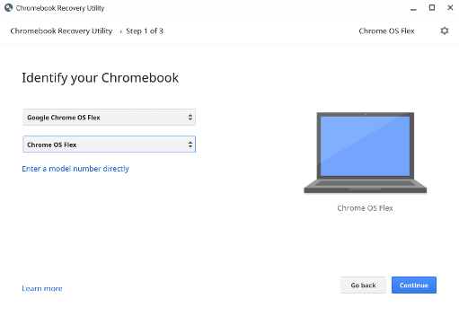
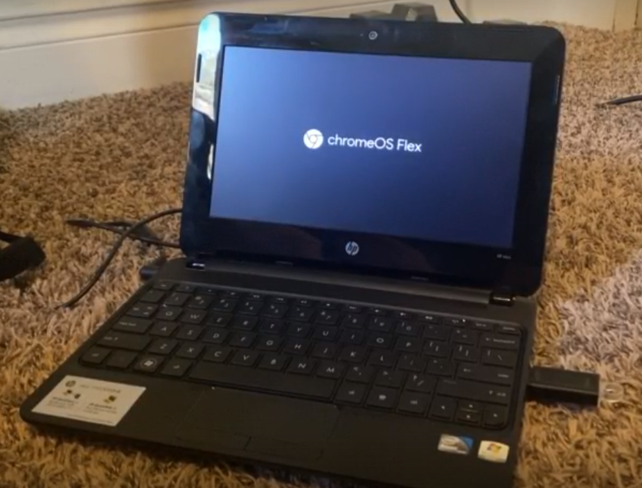

Chrome OS Flex is a way to run Chrome OS on almost any computer you would like, even if it isn’t a Chromebook. What we’ll be going through is the pros and cons, the installation process, and my personal experience with it, as I’ve been playing around with Chrome OS Flex on all the devices I have available to me. 

If you don’t know Chrome OS, it’s an operating system built around Chrome. The idea is that most people boot into whatever their OS is, and then the only thing they do is open a web browser. So, Google thought, why not get rid of the “bloat” that is an operating system and make Chrome the operating system? This makes the OS very dependent on web apps and things along that nature and makes Chrome OS one of the best choices for people who want to go on Facebook or write a Google Doc occasionally. However, Chrome OS is also bad for many people who depend on their computers for professional work.

https://youtu.be/oTOoqjycn2Q

## Pros and Cons

In terms of some of the pros, it’s very lightweight. It was designed with crappy $100 laptops in mind. These are the same laptops with Intel Celerons, 4GB of RAM, and sometimes storage as low as 16 GB. Chrome OS is also probably the OS that requires the least amount of maintenance, even compared to something like Windows or macOS. The system auto-updates by itself, but it’s not an annoying update process like Windows can be. Also, since everything is a web app, your apps don’t need to be updated either. This makes it the best OS to throw on a grandma’s computer so she can share back-in-my-day memes on Facebook all day. This would also be a good option for reviving older computers, in theory, because of the low resource usage.

The main issue with ChromeOS involves software compatibility. Because you are forced to use entirely web apps, you are also forced to deal with the limitations of a web app. For example, Microsoft 365 is missing many features in its web apps compared to desktop Microsoft Office, and even apps like Discord are missing features like push-to-talk on the web app. [This can be somewhat mitigated in an official Chromebook thanks to the support for Android apps](https://support.google.com/chromebook/answer/7021273?hl=en&ref=techhut.tv), but you aren’t getting that support on Chrome OS Flex yet. This also makes certain workloads on Chrome OS impossible. If you’re trying to do graphic design, gaming, or video editing on Chrome OS, it’s technically possible, but good luck. [If you are a power user, you can enable Linux support and run some Linux apps](https://support.google.com/chromebook/answer/9145439?hl=en&ref=techhut.tv), which is great. Still, compatibility with Linux apps is haphazard, so you’re better off running a Linux distro for software compatibility.  Another huge issue is the data collection Google collects from Chrome OS users. [Chrome is already known for being a privacy nightmare](https://www.forbes.com/sites/zakdoffman/2021/03/20/stop-using-google-chrome-on-apple-iphone-12-pro-max-ipad-and-macbook-pro/?sh=4385613c4d08&ref=techhut.tv), so take Chrome’s bad privacy and turn it into your entire operating system.

Chrome OS Flex has some hardware compatibility issues. Most computers should work, but there’s also a fair share that doesn’t. Just look at Michael MJD’s video, where Chrome OS Flex doesn’t install on several laptops he has, including two MacBooks. My experience was very similar. Although this is a developer previewer, even some of my hardware has gained better support since I last used it when it was announced. 

https://youtu.be/rBtRR5aFxF0

## Installation

The installation process is weird. Instead of downloading an ISO and burning that to a USB, you must download [Chrome’s special “Chromebook Recovery Tool” extension](https://chrome.google.com/webstore/detail/chromebook-recovery-utili/jndclpdbaamdhonoechobihbbiimdgai?ref=techhut.tv), scroll through a list of devices to select “Chrome OS Flex”, and then you can create a USB. Also, this tool doesn’t work on Linux, so if you are a Linux user you must manually download a .bin file and do burn that to a USB.

Luckily after this, the installation process is quite simple, in fact it only takes just a few clicks to get running. But this installer has is missing several options including custom disk partitioning which makes dual booting annoying because you must install Chrome OS Flex first before the other OS.

## Laptops

The first laptop I tried was an old garbage laptop with [Windows 7 Starter edition](https://www.lifewire.com/stay-away-windows-7-starter-edition-3507042?ref=techhut.tv). But it wouldn’t boot and stay stuck on the Chrome OS splash screen.

After that, I tried my ASUS ROG Zephyrus M16 Gaming laptop. However, it simply would not install on the device because it did not recognize the laptop’s SSD (not a surprise; even Windows needs drivers for this SSD). Luckily, I could boot into a live environment to test it out. After signing into a Google account, it was a wonderful experience. Chrome OS on a 2k display looks amazing, and it was super snappy, although I couldn’t get the Wi-Fi drivers to work, so I had to use Ethernet. Overall, though, all the web apps opened quickly, and just general use was very pleasant. I did try to get into a Linux environment, but, unsurprisingly, it did not allow me to do this in the live environment without fully installing Flex.

The next device I tried was a [ThinkPad T450](https://amzn.to/3ATp8S1?ref=techhut.tv). This is a great machine if you are looking for a budget laptop, [you can grab one of these with an I5 and a decent amount of RAM for between $200-300](http://amzn.to/3ATp8S1?ref=techhut.tv). I had much better luck this time running Chrome OS, and the device performs very well with basic tasks, including any web app. It did have higher RAM usage than what I’m used to, but it could be one of those things where “unused RAM is wasted RAM”. For regular web browser-type things, this should be a decent experience. The Wi-Fi does work, although it can be hit or miss by more advanced networks like my university’s Wi-Fi. The Linux environment was able to install correctly. I was able to open htop, and I was able to get GIMP working, although some menus had bugs. Installing Kdenlive through APT was a nightmare with many different flickering issues, although this machine isn’t powerful enough for Kdenlive anyway. This laptop is an example of how Chrome OS Flex shines, although I would still prefer to run a Linux distro on it.

Other than a web browser, the two applications I use most on Linux are Kdenlive and GIMP. GIMP ran well and performed remarkably, but Kdenlive flat-out did not work at all. It did open, though, and that’s a start. So, ignoring Linux for the time being, the actual device performed well. Having multiple tabs open made the system resources shoot up, but no major performance was hit while using the system. 

## Desktops

The last thing I tried was the [AMR5 Mini-Gaming PC](https://amzn.to/3uR5ti3?ref=techhut.tv). Just like the gaming laptop, the Wi-Fi didn’t work, although this is less of a big deal because it’s a desktop. However, it is weird that ChromeOS has so many Wi-Fi issues because of the Linux base. Firing up the machine and basic usage works completely fine besides Wi-Fi. I tried to do a screen recording on it for the YouTube video version of this article; the audio on this recording was garbage and even cut out completely after a while.

## Linux Applications

After enabling Linux applications on the mini gaming PC, GIMP worked completely fine on Chrome OS Flex, other than the menu issue mentioned earlier. After some tinkering, I figured out Flatpaks work a lot better than APT packages and AppImages worked the best, in fact the AppImage of Kdenlive was fully usable for editing on this system. Steam would install through Flathub, however Splitgate’s FPS counter showed 1 FPS and the screen was just black. I then removed the Flatpak and installed it through APT. After this, I got slightly further into Splitgate, but it was still a terrible experience, and CS:GO wouldn’t load at all.

## Overall

If you want to do anything beyond web browsing and web apps, Chrome OS is not a great option. If you have bad hardware, install a lightweight Linux distro. Installing Chrome OS on moderately good hardware is a complete waste of time because of all the limitations. As mentioned earlier, this is an early developer preview of ChromeOS, and it’s moving fast. Even the Thinkpad I tested earlier didn’t work a couple of months ago. Hopefully, if Linux apps worked better and I could have a smooth gaming experience, this could be a good experience, especially if you are in Google’s ecosystem. However, I would still recommend a standard Linux install over this.
