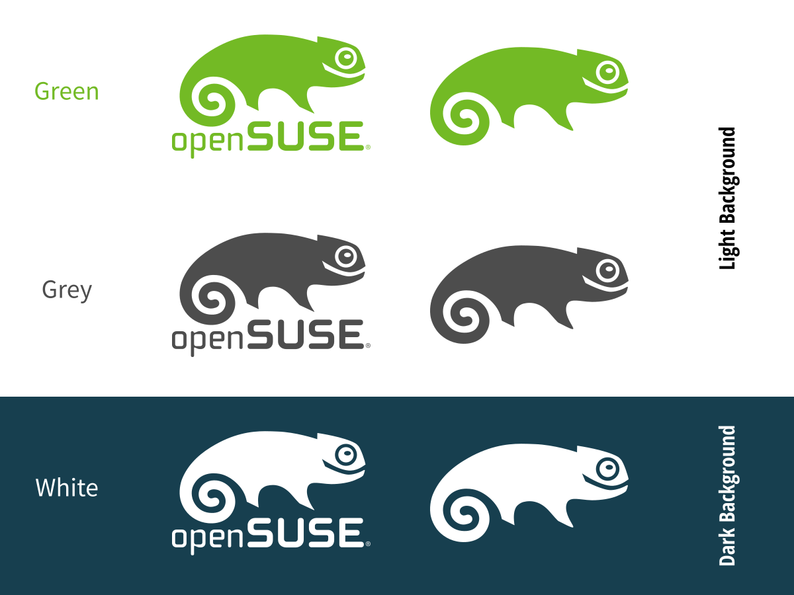
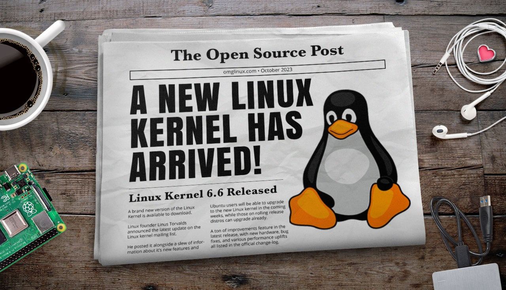
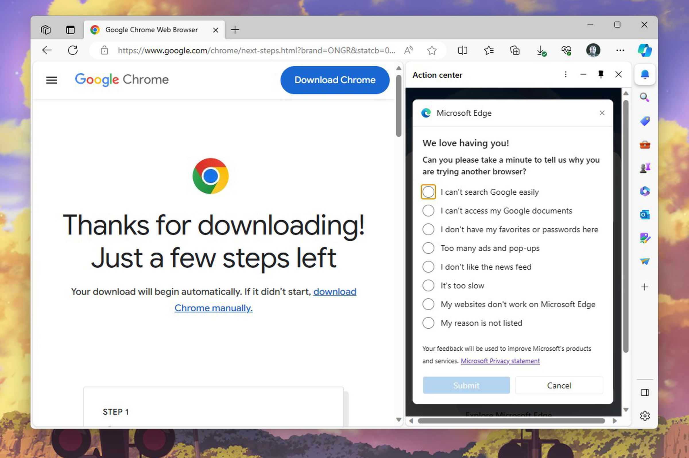

## UW Will Host the "SeaGL" Free Software Conference

The "SeaGL" (Seattle GNU/Linux Conference) is a yearly event that takes place in Seattle and has the goal of "spreading awareness and knowledge about free/libre/open source software, hardware, and culture". It will be hosted on the 3rd and 4rd of November, and all the talks will also be available online if you'd like to follow along. Skimreading the titles I see talks about programming an OS distribution, git code review, homleabs, organizing Hackatons, Blender for Beginners, and much more!

**Editors note: I will be there the first day! Looking forward to meeting some of you. If you happen to be in the Seattle area you should swing by. It's free and there is no need to register. If you can't make it, they will have an online stream. - Brandon Hopkins**

You can see all keynotes and talks here:

## OpenSUSE to Drop Current Logo and Host a Competition for a New One!

Pictured above: the current artwork used as OpenSUSE's logo; however, that won't be true for much longer. The project is currently going through a technical transition and has also experienced an upsurge in popularity; the developers have thus decided it's a great time to switch to a modern, chameleon-inspired design. I'm quite curious to see how this will turn out, and if you have the artistic skills to define the look of the project feel free to check the competition's requirements and submission instructions:

## New Linux Kernel Major Release: 6.6!

To quote Linus Torvalds's exact wording:

> So this last week has been pretty calm, and I have absolutely no
> excuses to delay the v6.6 release any more, so here it is.

I will quickly summarize the new features; however, I will warn you that I don't have the knowledge to understand them myself fully, so I would recommend that you also check out the in-depth article by omgubuntu. Firstly, the CFS scheduler has been replaced by a EEVDF one, which has the same role (dividing CPU time between processes) but it does so in a more efficient way; the catch is that it might lead to performance regressions on specific workloads. Memory efficiency in tracing subsystem is improved by a new `eventfs` subsystem, the filesystem CephFS now supports FSCRYPT, and KSMBD is no longer experimental.

There are improvements on the AMD front, such as the support for AMD Dynamic Boost Control, fixes for kernel panics on AMD Zen systems, support for AMD Zen 5 temperature, and AMD P-State features control via `cpupower`. On the Intel side of things, Linux gained support for "Intel Shadow Stack", a hardware feature that protects applications from "return-oriented programming" attacks.

As mentioned above, feel free to check out the full story with more details here:

## Mastodon Introduces "Lists"

And they're pretty cool! You'll now be able to create lists based on specific topics and interests, and the posts that fit in those categories will be automatically _hidden from your home feed_ and shown in its own view. This "helps in decluttering your home feed but also allows you to engage with certain topics on your own terms, when you are ready", which I feel like is a great idea especially from a "news" point of view; an user might want to have a more entertaining/positive home feed by "hiding" e.g. posts about political events in a separate view to go through at the right time.

That's the good news. The bad news is that, even though the feature is already available on the website, the iOS development was slowed down by some performance and crash issues, and it's unclear when it will land.

## Fedora 39 Release was Further Delayed

This is a very quick update to say that the release of Fedora 39 was delayed by a week, yet again. I've already covered the issues that were raised last week, and sadly three more bugs were found in the past few days; the developers have thus decided to further delay the release to the 7th of November. However, as I mentioned last time, keep in mind that this is purely a target and it might be further postponed.

## Microsoft Wants You to Switch to Edge. Seriously.

This is a section that is meant to be a bit more fun, and it allows us to see why Free and Open Source Software is so important. The Verge has put together a great webpage that collects every single action that Microsoft has taken to push their browser Edge onto Windows users. This includes, but is not limited to: showing a poll when you download Chrome, showing a pop-up to convince people to ditch Chrome, include fake AI answers if you Bing for Chrome, forced Outlook and Teams to open all links in Edge, inserted a text to convince people to use Bing AI on Bard (Google competing service) webpage, and so on. In fact, all of this is so bad that Europe stepped in and required Microsoft to stop forcing Edge onto Windows 11 users.

I really recommend going through the complete list, as it makes for a great laugh:

**_Notice: This is an older newsletter; many links and images were lost in the migration process. Click [this link](https://archive.techhut.tv/) for an archive of the old newsletter site_**.
