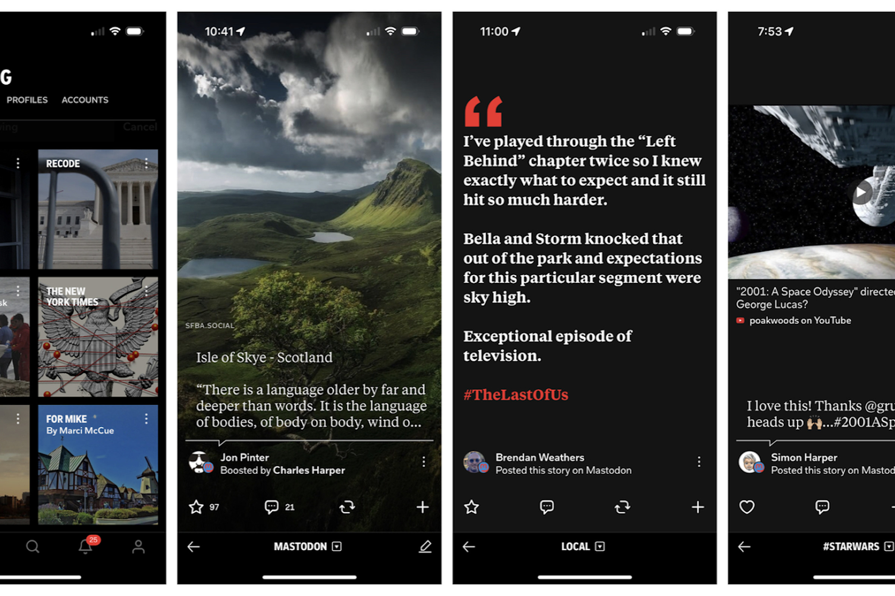
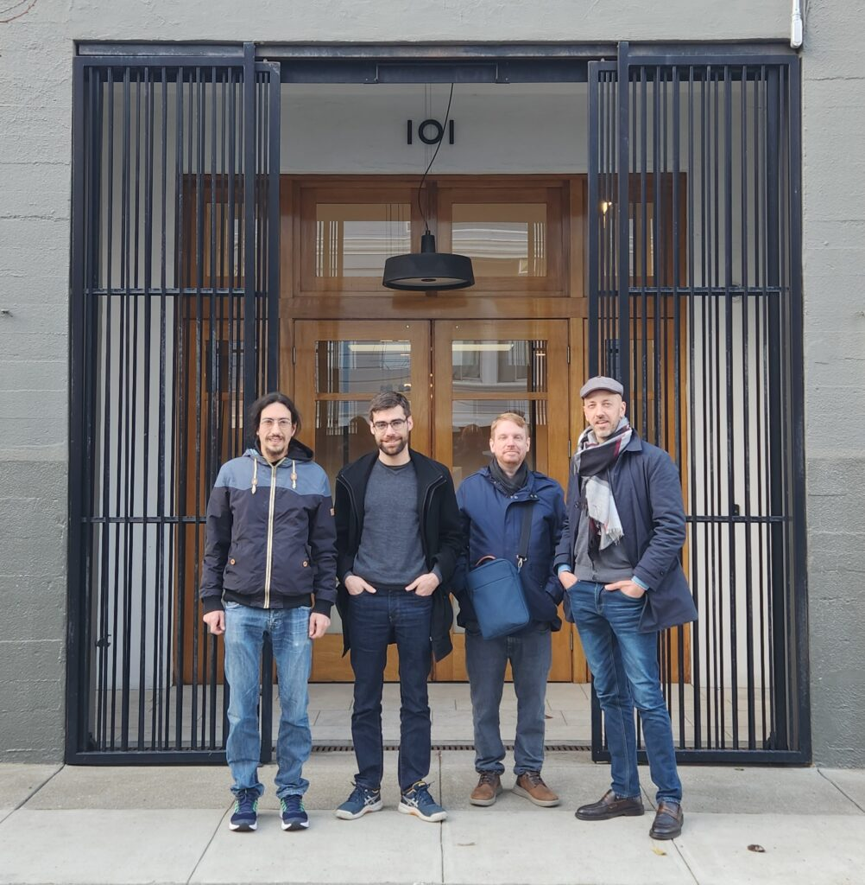

## COSMIC Development Updates: Text Editor, Multi-Monitor, and more!

The latest System76 blogpost features the changes implemented in the work-in-progress COSMIC desktop during the last month of development. Let's start with the text editor; we can see how some new features are quite basic, such as "double-click to select word" and "triple-click to select line". That makes sense: again, System76 is trying to build a desktop from scratch and they will have to work on these types of things too.

But there's some cool stuff as well: there's now a context drawer that allows you to search throughout a project (see screenshot above). Git status and git changes support were also added, meaning that you can compare different versions of the same files with an intuitive interface (deleted lines in red, added lines in green).

You can now set a shortcut to move your entire workspace (a.k.a. all open windows ) to the next display, and there's a more intuitive logic that selects which monitor to switch to. Support was also added to automatically move windows between monitors when plugged in/out.

If you're interested in the project development, make sure to check out the full blogpost, which also comes with extra screenshots:

## Flipboard and Threads are joining the Fediverse

Both Threads and Flipboard are beginning to experiment with the ActivityPub protocol. Both platforms offered a limited amount of accounts to opt-in to this feature, which will make those users visible and interactable by any ActivityPub-based social network, such as Mastodon. Both platforms plan to slowly expand on this feature so that anyone can benefit from this; however, that's going to take some work.

As an example, replies to Thread posts written by e.g. Mastodon users will not appear on the Thread app, but developers are working on it. Mosseri, Instagram head, also said that they plan to allow Thread accounts to move to a different app/server whilst retaining all of their followers. Flipboard CEO Mike McCue is even more direct: "We're in the process of replacing our whole social back-end with ActivityPub"; this will make Flipboard effectively the same as any other ActivityPub-based platform, such as Mastodon or Pixelfed.

## W4 Games raises $15M to develop Godot Engine

Wait, what's "W4 Games"?

Well, it's a company recently founded by three Godot Engine veterans (**Juan Linietsky**, **Rémi Verschelde**, and **Fabio Alessandrelli**) and one entrepreneur (**Nicola Farronato**) to strengthen the open source Godot ecosystem; they plan to do that by offering "commercial products and services" to companies.

It is not unusual for large non-profit open-source projects to also be backed by for-profit companies; we don't know yet how beneficial W4 Games will be to the Godot ecosystem, but it is certainly good news that they managed to raise $15M in funding to start their work. They plan to work on projects such as W4 Consoles (a middleware console porting solution for Godot games) and W4 Cloud ("multi-tenant service to support millions of users").

## Plasma Mobile is getting ready for a new Major Release!

KDE Plasma 6 will be released towards the end of February; this will be a mega-release, meaning it will include the desktop, applications, frameworks, and Plasma Mobile. Devin, one of the core developers of the project, has published a blogpost explaining all the work he is doing to prepare the release.

One of the most user-visible changes will be the home-screen; Plasma Mobile used to have a very Android-like home, which drag-and-droppable apps and widgets, and a application grid that's accessible by swiping from the bottom of the screen. However, this home-screen was not stable enough and was known to brick the shell; because of that, one year ago Plasma Mobile switched to a different home-screen called "Halcyon". This one simply provided a list of applications the user could scroll through.

Devin has spent the last five weeks completely rewriting the classic "Folio" home-screen. You can see how good it looks in the above screenshots, and it should now be stable enough to be used out-of-the box by the Plasma Mobile project. It supports: an app drawer, KRunner search, folders, pages, widgets, customizable row and columns, customizable page transitions, ability to import-export layout files, and more.

The full blogpost contains a lot of technical details too, and it's a great read if you're interested in the project:

**_Notice: This is an older newsletter; many links and images were lost in the migration process. Click [this link](https://archive.techhut.tv/) for an archive of the old newsletter site_**.
