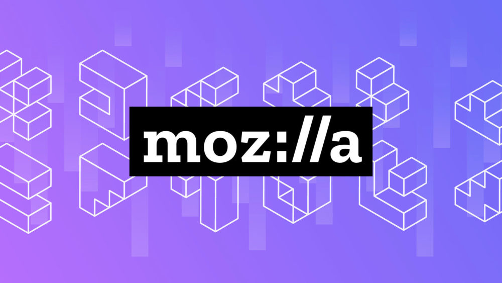

## PeerTube v6 announced with Storyboards and Chapters

Peertube is a decentralized video platform; its ambitious goal is to be an alternative to closed-source for-profit websites such as YouTube, Twitch, Vimeo, and so on. The latest version includes many quality-of-life improvements, some of which are not available on competing platforms.

Firstly, you can protect videos with passwords. Creators can set a single password when they upload or import the settings of their videos. Developer Wicklow did this during an internship.

Secondly, hovering the mouse on the video progress bar will show a thumbnail of that specific timestamp. This feature is called "Storyboards"; the previews will be generated when a video is uploaded, but instance admins can dedicate some CPU time to create them for existing videos too.

Thirdly, you can now change the video after it has been published. On competing platforms, such as YouTube, this is only available to bigger channels that have direct partnerships with the platform.

Finally, PeerTube now features chapters. These work similarly to YouTube's, and they will be automatically imported from them. Quoting the official announcement: when chapters are set, markers will appear and segment the progress bar. Chapter titles will be displayed when you hover or touch one of these chapter segments.

All of this was developed by Framasoft, a French non-profit organization and collective founded respectively in 2002 and 2004. They develop distributed services and offer them freely to users. They're currently running a fundraiser; you can check everything about both PeerTube and Framasoft here:

## Roundcube (FOSS email client) joins Nextcloud

You might not have heard of Roundcube, but it's a very popular open-source email platform. It's an IMAP client, but it also offers a Webmail Client (pictured above). The project is used by Harvard, Cambridge, the European Commission, HostGator, and GoDaddy.

The direct consequences of this partnership are somewhat unclear. Nextcloud has its own "competing" product, and they've stated they don't want a direct merger between the two; quoting the announcement: neither will Roundcube replace Nextcloud Mail or the other way around. The idea is to strengthen the world of open-source alternatives to closed-sourced software.

## Cinnamon 6.0 lands with initial Wayland support

Development of Cinnamon 6 was recently completed, and the final release landed on GitHub. The major feature of 6 is the Wayland session; however, it's still in an experimental stage, and bug reports are particularly appreciated to improve it over time. The new Wayland session also supports experimental fractional scaling for HiDPI screens; however, some other desktop features don't have full support yet and have been disabled.

Other new features include Telegram Desktop audio playing appearing in the Sound applet, support for AVIF images, a new gesture for desktop zoom, color picker support in the screenshot service, and a xdg-portal configuration file. The desktop will be used in the next Linux Mint release, due in just a couple of weeks.

## Zorin OS 17 released with Quick Settings, Spatial Desktops, and More

The newly-released Zorin OS 17 uses an interesting approach to deliver an updated desktop experience: though it's still based on Ubuntu 22.04, which uses GNOME 42, Zorin OS 17 ships with GNOME 43. This allows them to include many of the new GNOME features, such as Quick Settings, full GTK4 theming, new Power modes, new screenshot and recording experiences, and a refined Activities Overview.

The team has also decided to include some extensions/effects out of the box. The most noticeable one is the "Spatial Workspace Switcher", which replaces the standard Alt+Tab and Super+Tab dialogs with a 3D window switcher; you'll also have the Desktop Cube, which you can freely rotate to switch between desktops.

The Zorin OS-specific features are all about layouts. Though the desktop is based on GNOME 43, Zorin gives it a very unique spin. You can see above a quite classic layout, but version 17 will come with two new layouts that imitate GNOME 2 and Google's Chrome OS desktops. However, these will only be available in the Zorin OS 17 Pro edition.

## Mozilla Foundation has four new Board Members

Mozilla recently announced that it has expanded its board. The new members are: Alondra Nelson, Edwin Macharia, Raffi Krikorian, and Zain Habboo. The idea is to expand the scope of the Mozilla Project, working closely with the Boards of the Mozilla Corporation, Mozilla.ai and Mozilla Ventures. It's a bit of a super-board for the entirety of the company and its various projects.

If you're interested in the background of each of the new members, you can find them here:

**_Notice: This is an older newsletter; many links and images were lost in the migration process. Click [this link](https://archive.techhut.tv/) for an archive of the old newsletter site_**.
