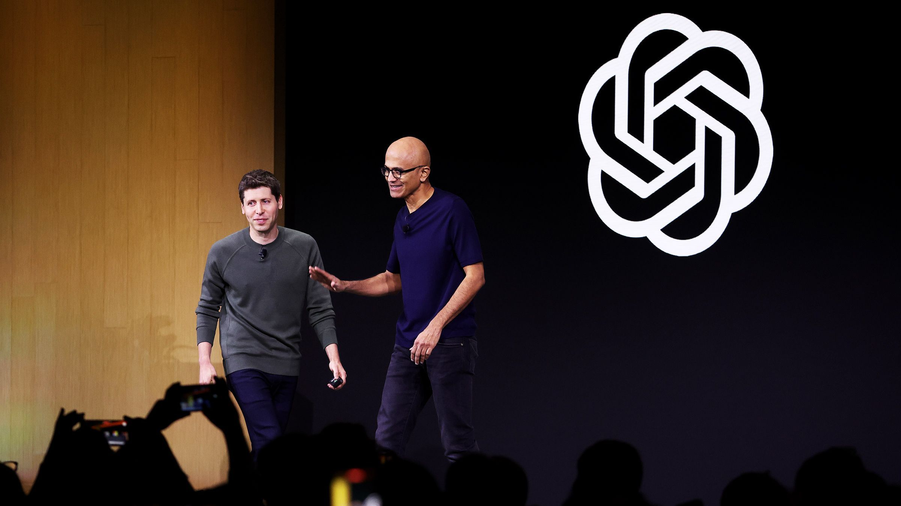
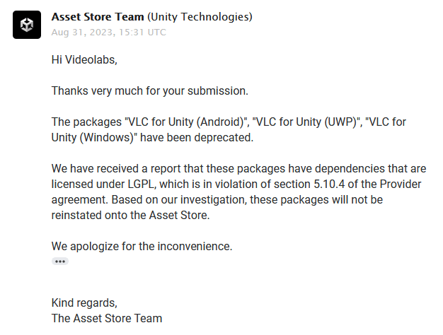

## GNU Project to support private and secure online payments

Did you know that GNU has a microtransaction and electronic payment system? It's called "GNU Taler", and it's developed by Luxembourg-based company Taler (along with the GNU community). The project provides the ability to pay anonymously, but the payees are always identified; these are the words of none other than Richard Stallman, who's known for being skeptical about digital payments. Note that GNU Taler achieves this without making any use of cryptocurrencies or blockchain.

The great news of this week is that the Eindhoven University of Technology is leading a pilot project, operated by eight European countries, with the objective to "roll out an innovative electronic payment system" – GNU Taler. This test is called NGI TALER and it's an European joint effort. Another great benefit is the lower transaction costs of this system, which will make it particularly appealing for merchants and banks.

Though we're just at the beginning stages of this project, it already sounds quite interesting and could one day have a real impact on the privacy of our everyday lives!

[https://www.tue.nl/en/news-and-events/news-overview/17-01-2024-tue-coordinates-eu-project-to-push-next-generation-private-and-secure-online-payments?ref=techhut.tv](https://www.tue.nl/en/news-and-events/news-overview/17-01-2024-tue-coordinates-eu-project-to-push-next-generation-private-and-secure-online-payments?ref=techhut.tv)

## Framework Laptop 16 Reviews are Out!

Photo by The Verge, see link below

I've talked multiple times about the Linux-friendly and modular Framework Laptop 16. You should now know the main selling points by heart: hot-swappable GPUs, modular ports and components, extremely easy to open up & repair, and so on. However, the company had not allowed any review to be released yet; that embargo expired yesterday, and we are now flooded with content.

The overall feeling I got from these reviews is: the idea behind the device is great, but the device's build quality is not what we would expect from such a high price; will we forgive those issues to get the extra modularity? The Verge sums it up as: "How much will you forgive for a one-of-a-kind notebook?".

You can find a link to the review below, but you can also probably find one at your local favorite tech enthusiast page.

[https://www.theverge.com/24047424/framework-laptop-16-review?ref=techhut.tv](https://www.theverge.com/24047424/framework-laptop-16-review?ref=techhut.tv)

## Firefox 122.0 Released

Mozilla has released Firefox 122.0 yesterday. Firstly, Firefox now finally ships with a DEB package that can be used to install the browser in Debian-based distributions. This is important since Ubuntu's `apt` package manager automatically installs Firefox as a containerized `snap` rather than a DEB package. 9to5linux, link below, explains that some Ubuntu derivatives such as Linux Mint decided to revert that behavior by creating their own DEB; they won't have to provide something custom anymore, since there's the official one.

Firefox 118 introduced a built-in translation tool; Firefox 122 brings some bugfixes to that function, e.g. widgets not breaking and content not disappearing when translated. You can read about this and much more here:

https://9to5linux.com/mozilla-firefox-122-is-now-available-for-download-heres-whats-new?ref=techhut.tv

## OpenAI's ChatGPT can now be used for military and warfare

It doesn't sound promising, does it?

OpenAI's usage policies page used to include a ban on military and warfare up until January 10; it has since been updated, and even though the new page still bans to use of their services to "harm yourself or others" and/or "develop or use weapons", the mention of "military and warfare" has disappeared. This has been justified by saying that the new policies are easier to understand:

> “We aimed to create a set of universal principles that are both easy to remember and apply, especially as our tools are now globally used by everyday users who can now also build GPTs,” OpenAI spokesperson Niko Felix said in an email to The Intercept. “A principle like ‘Don’t harm others’ is broad yet easily grasped and relevant in numerous contexts. \[...\]”

Of course, there's more to it:

> In a subsequent email, Felix added that OpenAI wanted to pursue certain “national security use cases that align with our mission,” citing a plan to create “cybersecurity tools” with DARPA

## Unity banned VLC due to LGPL license

Developer Martin Finkel has recently published a blogpost illustrating his attempt to distribute a binary of "VLC for Unity", an integration that allows building media players based on VLC in Unity-based games. This attempt was initially successful, but Unity has removed the project from its store through the above e-mail. Unity has since made it clear that they wouldn't allow VLC back even if they removed all LGPL parts.

As a result, the VLC team quickly set up a new store on the Videolabs website, which even offers multimedia consulting with them. You can read more about it here:

[https://mfkl.github.io/2024/01/10/unity-double-oss-standards.html?ref=techhut.tv](https://mfkl.github.io/2024/01/10/unity-double-oss-standards.html?ref=techhut.tv)
