Today I'll be showing you how it can actually be pretty simple to get a self hosted monitoring system set up for your home lab. The idea is to collect and visualize key data about your machines, like how much CPU, RAM, and disk capacity is being used over time.

Having monitoring in place can be really useful for understanding if there are adequate resources dedicated to your various services, and it can also just be a lot of fun to look at. Before we go any further, here's a sample screen shot of what our end result will look like:

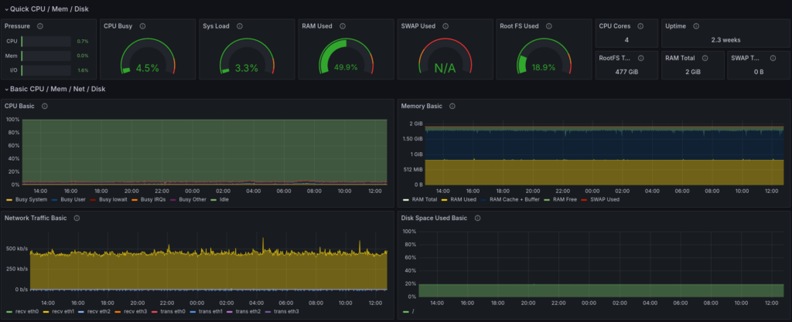

### Grafana, Prometheus, and Node Exporter

What you're looking at above is a Grafana dashboard. In the IT industry, Grafana has become essentially the standard tool for visualizing various performance metrics both about systems and services themselves. But it's definitely not limited to that domain, and you'll also see Grafana being used sometimes in home monitoring and home automation setups. So that's to say that it's a valuable tool to learn which we'll really just scratch the surface of in this tutorial.

When it comes to monitoring computers, whether those are bare metal systems or virtual machines, Grafana is commonly paired with another industry standard tool known as Prometheus. The role of Prometheus is gathering data points at regular intervals in a process known as "scraping". That data is then made available to Grafana to be visualized in the dashboard.

The full deployment consists of two main aspects. First are the Grafana and Prometheus services which in this case we'll be running in Docker containers. Second is what's known at the "node exporter" service that is part of the Prometheus project. The exporter runs on each machine to be monitored and makes the machine's metrics available to be scraped by the main Prometheus app.

That also means of course that all of the machines in the monitoring group need to be reachable in the same network as the machine hosting the Prometheus Docker container. It doesn't matter if that's a regular LAN or some kind of private overlay networking solution. There are more advanced options, like connecting multiple Prometheus instances together or using authenticated connections over the public internet, but we won't cover any of that here.

### InfluxDB and Telegraf

InfluxDB and Telegraf and very similar to Prometheus and the Node Exporter. The reason I'm adding these tools to the step up is because it gives us more options to gather data to visualize with Grafana. While there are many services that provide direct support for Prometheus, that's not always the case. Telegraf has a wide range of plugins and for some services it's just a more natural fit than Prometheus. Having both of them set up means that you'll likely have a very simple way to get started with monitoring anything in your lab with one or the other.

InfluxDB is a specialized time-series database designed to store and manage data indexed and queried by time. It’s particularly useful for handling metrics, events, and other time-based data. InfluxDB provides a query language called InfluxQL and APIs for retrieving and analyzing time-series data. Don't worry if that sounds like a lot—you don't need to write queries or use the API directly to do awesome things. In fact, the UI of InfluxDB is rather nice as you'll see below and it works as a standalone visualization tool too.

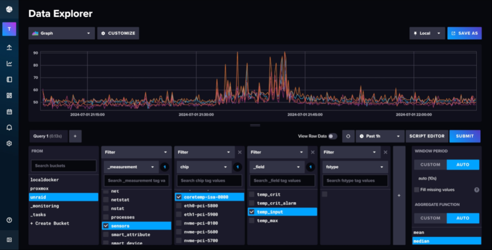

Telegraf, on the other hand, is an open-source server agent developed by InfluxData, the same people behind InfluxDB. Its main purpose is to collect and send metrics and events from various sources, including databases, systems, and IoT sensors. It offers a wide range of input plugins (300+ community-contributed) and can be customized to collect data from cloud platforms, containers, and more. Telegraf is especially useful when paired with InfluxDB, as it efficiently sends collected metrics to the database for storage and analysis.

## Installing and Starting Node Exporter

The Prometheus node exporter is widely available as a package in the official repos of various Linux distros. To start we will be installing this Exporter on the same machine that we plan on running with our stack. For Ubuntu and other Debian based distros, you can install it like this:

```
sudo apt install prometheus-node-exporter
```

While apt should start and enable the systemd service for the node exporter automatically, you can double check that like this:

```
sudo systemctl status prometheus-node-exporter
```

As an aside, you might be wondering why we're using a system package for the node exporter while using Docker containers for the rest. While it's true that the node exporter can run inside a container too, doing so limits the visibility it has into the system's resources, particularly disk space. Using a system package is the simplest way to ensure that all the data is available.


### Monitoring Linux host metrics with the Node Exporter | Prometheus

An open-source monitoring system with a dimensional data model, flexible query language, efficient time series database and modern alerting approach.

## Deploying the Docker Containers

Alright, now let's get started with the deployment of the containers. For this part I'll assume you have a machine set up with Docker already. If not, we have an [article and video on getting started with Docker](https://techhut.tv/7-docker-basics-for-beginners/) that will get you up to speed. What I'll show here is using a Docker Compose file and Docker's command line interface.


### 7 Docker Basics for Beginners

Docker is a platform that allows you to work with containers and containerized applications....

I've uploaded my configurations and compose.yaml file to Github making it really easy to clone and get started. I will do my best to keep both this guide and the repository updated with any changes and improvements. Also, if you're following the video guide I will post changes here.

When you clone the repository make sure it's wherever you want some configuration files and scripts for services to be stored. Generally, I just do this in my user home directory.

```
git clone https://github.com/TechHutTV/server-monitoring.git
```

After you pull the repo, it will be in the 'server-monitoring' directory. Now is a good time to rename that if you'd like. Now let's move to that directory and see what we're working with.

```
cd server-monitoring
```

Now we can see how the included files are laid out:

```
tree
.
├── compose.yaml
├── grafana
│   └── datasource.yml
├── prometheus
│   └── prometheus.yml
├── README.md
├── telegraf
│   └── telegraf.conf
└── unraid
    ├── README.md
    ├── telegraf.conf
    └── unraid-data-preview.png

4 directories, 8 files
```

### Docker Compose Configuration

Let's go through each file and cover any changes that you might need to make for your particular setup. First is `compose.yaml`, which is our Docker Compose file.

One thing we added is an `extra_hosts` section under some of the services. This will enable them to access the data exporters running on the host system outside of Docker by adding an entry to the container's `/etc/hosts` file. If you have DNS set up for your LAN, then this part is not necessary. You can just substitute the DNS name as needed.

Below I show using an example hostname on my test machine of "dockerlab" but replace this with yours throughout the guide. The important thing to note is that the data will be tagged with this name inside Prometheus as the machine name, and if you change it later, you'll end up with multiple entries for the same machine. Using the same name as the host name for this machine is a good idea. To check it, run this in a terminal:

```
hostname
```

The volumes are one thing that you might also want to change. With the defaults shown below, all the data collected will be stored in the Docker data directory of the machine running Docker. If you need more space or have another reason to store the data elsewhere, you might consider using a bind mount to networked storage or another disk. Volumes and bind mounts are covered in out [Docker guide](https://techhut.tv/7-docker-basics-for-beginners/). Note that Grafana itself stores only a little data for things like settings. The bulk of the data is stored in the Prometheus and InfluxDB data volumes.

With that noted, let's jump into the compose file.

```
nano compose.yaml
```

Here's what it should look like. Don't forget to replace "dockerlab" with your own host name:

```
services:
  prometheus:
    image: prom/prometheus
    container_name: prometheus
    command:
      - '--config.file=/etc/prometheus/prometheus.yml'
    ports:
      - 9090:9090
    restart: unless-stopped
    extra_hosts:
      - "dockerlab:host-gateway"
    volumes:
      - ./prometheus:/etc/prometheus
      - prom_data:/prometheus
  grafana:
    image: grafana/grafana
    container_name: grafana
    ports:
      - 3000:3000
    restart: unless-stopped
    volumes:
      - ./grafana:/etc/grafana/provisioning/datasources
      - grafana_data:/var/lib/grafana
  influxdb:
    image: influxdb:2.7.6-alpine
    container_name: influxdb2
    ports:
      - 8086:8086
    extra_hosts:
      - "dockerlab:host-gateway"
    volumes:
      - influxdb2_data:/var/lib/influxdb2
      - ./influxdb2/config:/etc/influxdb2
      - ./influxdb2/scripts:/docker-entrypoint-initdb.d
  telegraf:
    image: telegraf:latest
    pid: "host"
    container_name: telegraf
    user: telegraf:999
    restart: always
    entrypoint: /bin/bash -c "/entrypoint.sh telegraf"
    extra_hosts:
      - "dockerlab:host-gateway"
    volumes:
      - /var/run/docker.sock:/var/run/docker.sock
      - ./telegraf/telegraf.conf:/etc/telegraf/telegraf.conf:ro
      - /:/hostfs:ro
    environment:
      - HOST_ETC=/hostfs/etc
      - HOST_PROC=/hostfs/proc
      - HOST_SYS=/hostfs/sys
      - HOST_VAR=/hostfs/var
      - HOST_RUN=/hostfs/run
      - HOST_MOUNT_PREFIX=/hostfs
volumes:
  prom_data:
  grafana_data:
  influxdb2_data:
```

Before running this stack ensure there won't be any conflicting network ports. Here we are exposing the default ports: 3000, 9090, and 8086. If any of these ports are already used on your Docker machine, you can edit these as needed by changing the port number to the left of the colon. Since Grafana will access Prometheus and InfluxDB over Docker's internal network, you don't need to change it's configuration when you change the exposed ports. It will only matter when you want to connect to each service directly. Mostly that will be Grafana, but each exposed port has a web UI that we'll be visiting in this guide, so substitute your updated port numbers as needed if you change them.

### Prometheus Configuration

Let's save and close the compose.yaml file, and then go check the Prometheus configuration:

```
nano prometheus/prometheus.yml
```

This file already contains some default values, mostly notably a default global scraping interval of 15 seconds. That means that you would get a data point from each machine you are monitoring every 15 seconds.

.stk-372b0ea{margin-bottom:0px !important}

```
global:
  scrape_interval: 15s
  scrape_timeout: 10s
  evaluation_interval: 15s
```

This is a reasonable default, but you can edit it if you like. Just note that if you do change the interval, it's important that you also set the same interval inside the Grafana interface later. So, keep that in mind and we'll see where to do it in just a bit.

.stk-c13962b{margin-bottom:0px !important}

@media screen and (min-width:768px){.stk-54ca266{flex:var(--stk-flex-grow,1) 1 calc(50% - var(--stk-column-gap,0px) \* 1 / 2 ) !important}}

```
alerting:
  alertmanagers:
  - static_configs:
    - targets: []
    scheme: http
    timeout: 10s
    api_version: v1
```

@media screen and (min-width:768px){.stk-5ca674f{flex:var(--stk-flex-grow,1) 1 calc(50% - var(--stk-column-gap,0px) \* 1 / 2 ) !important}}

After the global settings section at the top, there's an alerts section. Prometheus has the ability to trigger alerts, for example if a disk is getting too full, and actually Grafana has its own separate alerts feature as well. We won't get into that aspect for this tutorial though and so we can leave that part of the config alone.

.stk-b80397f{margin-bottom:0px !important}

```
scrape_configs:
- job_name: prometheus
  honor_timestamps: true
  scrape_interval: 15s
  scrape_timeout: 10s
  metrics_path: /metrics
  scheme: http
  static_configs:
  - targets:
    - localhost:9090
```

Below the alerts section there's the first scraping target, which is actually Prometheus itself. That's right, Prometheus can gather data on itself, such as whether it's experiencing any errors or failures. The data Prometheus gathers on itself is probably more relevant in large scale and high stakes environments, but it won't take up much disk space and you might find it interesting to have at some point.

What we want to do is add an additional job that scrapes the node exporter service running on each machine we want to monitor. Here's the template for what to add:

```
- job_name: node_exporter
  static_configs:
    - targets:
      - hostname/IP:9100
```

This instructs Promethus to scrape data from the node exporter's default port of 9100 on a given host. One important note here is that the data in Grafana will be labeled with the hostname that we write here. So while "localhost" is a valid target for monitoring the machine that Prometheus is running on, you might find it makes things clearer later if you use the hostname instead. To check the machine's hostname, you can use the \`hostname\` command in the terminal.

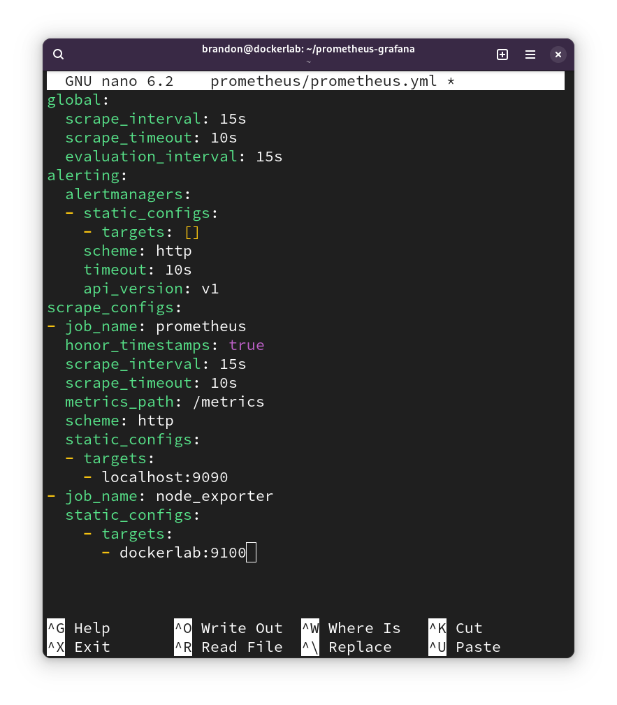

We can access a web UI for Prometheus by visiting port 9090 in a web browser. Prometheus includes some of its own graphing capabilities via this interface, but what we're interested in is the _Targets_ view under _Status_. Here we can see each of the node exporter targets, as well the Prometheus self monitoring target.

When Prometheus can reach the targets for scraping, these show a green _Up_ icon. If something has gone wrong, you'll see a red _Down_ icon. So, this view is good for troubleshooting, to discover if Prometheus is able to reach the node exporter services running on the machines you want to monitor.

### Grafana Configuration


There's also a datasource.yml in the `grafana` folder. We don't need to make any edits as it just specifies that Prometheus will be a data source and where to reach it on the network. Since these two containers are in the same Compose deployment, Grafana can reach Prometheus by Docker DNS at the name `prometheus` and on its default port of 9090.

## Starting the Services

.stk-147acba{margin-bottom:0px !important}

That concludes the initial config file changes that we need to do. At this point we're ready to start up the containers and connect to our new services. Just make a note of whichever is present on your system and substitute the right form in the commands below if needed. To start the deployment run this:

.stk-ded6301{margin-bottom:0px !important}.stk-ded6301-column{row-gap:0px !important}

@media screen and (min-width:768px){.stk-1f75796{flex:var(--stk-flex-grow,1) 1 calc(46.4% - var(--stk-column-gap,0px) \* 1 / 2 ) !important}}

```
docker compose up -d
```

@media screen and (min-width:768px){.stk-57258cc{flex:var(--stk-flex-grow,1) 1 calc(53.6% - var(--stk-column-gap,0px) \* 1 / 2 ) !important}}

The `-d` flag here instructs Docker to run the deployment in the background and not print all the logs directly to the screen.

If you see any errors, it's possible that there's a mistake in your `compose.yaml` file or in one of the configuration files. In that case I'd suggest to go back and look for any errors or deviations from what I showed above.

### InfluxDB 2 Setup

With InfluxDB there is no manual configuration required. However, we will need to setup our credentials to create buckets later on. Open your browser and navigate to your IP address followed by the port 8086. Fill in everything. In our example, I am setting up the initial bucket as 'influxdb' as the software will have some of its own data to store.

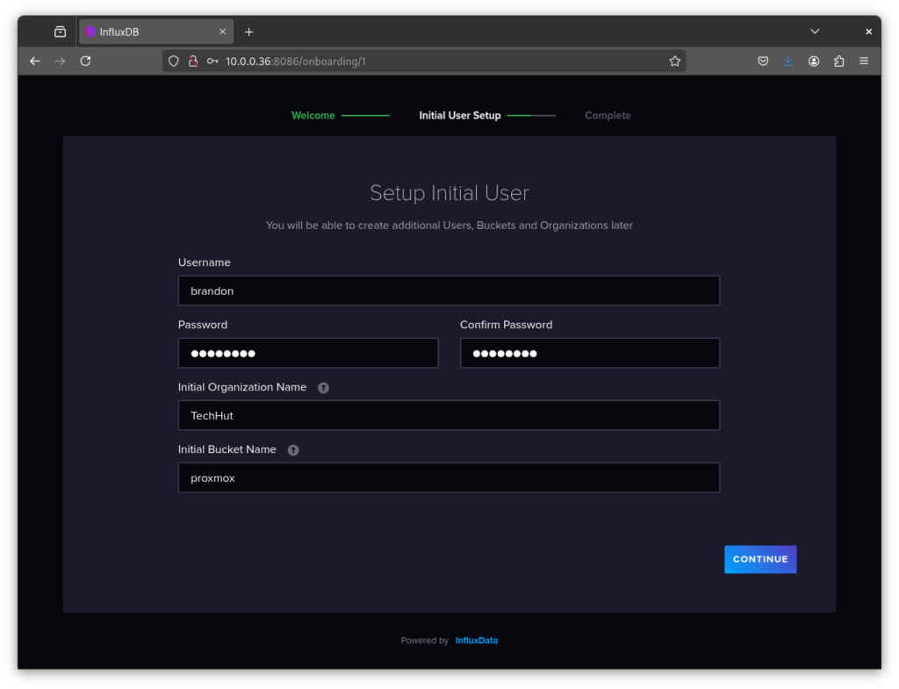

Once you hit continue there will be a secret key. Make sure you save this as we will use it later. Alternatively, we can create API keys in the dashboard in the future.

InfluxDB is a very powerful tool with a ton of features. I highly recommend you read up on the documentation and learn a little about it. It's designed so well that if you just wanted a database platform with simple graphs this could be a great stand-alone option for you. Below is a screenshot of Proxmox data that we will import later in this guide.

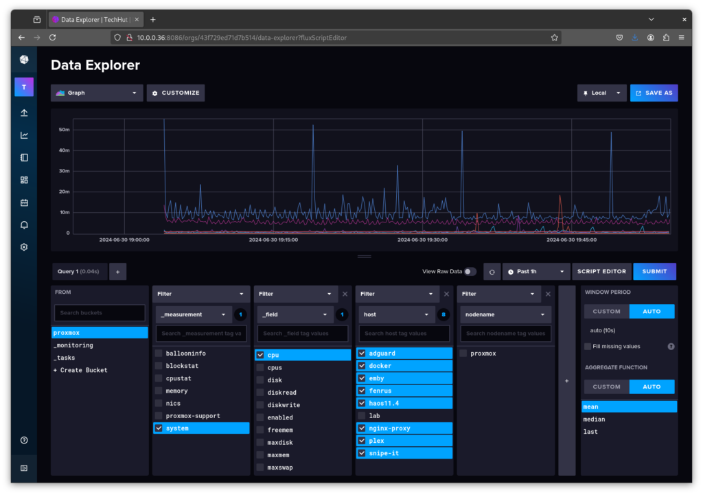

#### Grafana Setup

With the containers up, we can now go and connect to Grafana and set up our dashboard. By default, Grafana will be exposed on port 3000 on the machine running Docker. Go ahead and type the IP/port or host/port combo into your browser, and then log into Grafana with the admin/admin for the username and password. It will then prompt you to change it.


First, here in the Grafana interface, let's go to the _Connections_ section and select _Data sources_. This is where we manage and add all the sources that Grafana will use to display data.

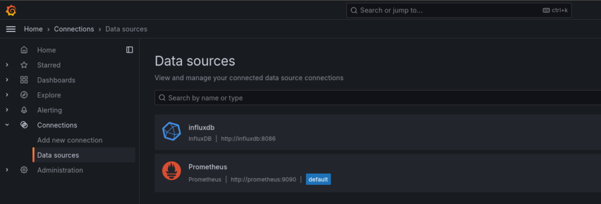

##### Prometheus

By default, we should see our Prometheus data source here, which was added according to the Grafana config file. If we open up the Prometheus data source and scroll down a bit, we can see the scrape interval configuration. As I mentioned earlier, if you changed your scrape interval in the Prometheus configuration, you should also change it here so they are the same. Otherwise you can run into issues where the data does not display properly on the graphs.

Scrolling down a bit more, we can see the _Save & test_ button, which also provides a helpful way to confirm that Grafana can reach Prometheus to grab data. Now speaking of diagnostics, let's go take a look in the Prometheus web interface to see how we can check the status of Prometheus scrape jobs.

##### InfluxDB 2

The InfluxDB source won't be loaded in there automatically like our Prometheus data source was. We will need to add this manually. Under 'Connections' in the left navigation pane click on 'Add new connection', then type "InfluxDB" within the search bar. Click on the result to setup the connection. Name this what you'd like, and for my setup I will be using InfluxQL as the language. Flux is another good option, but it is in beta and many of the popular dashboards will not work with Flux.

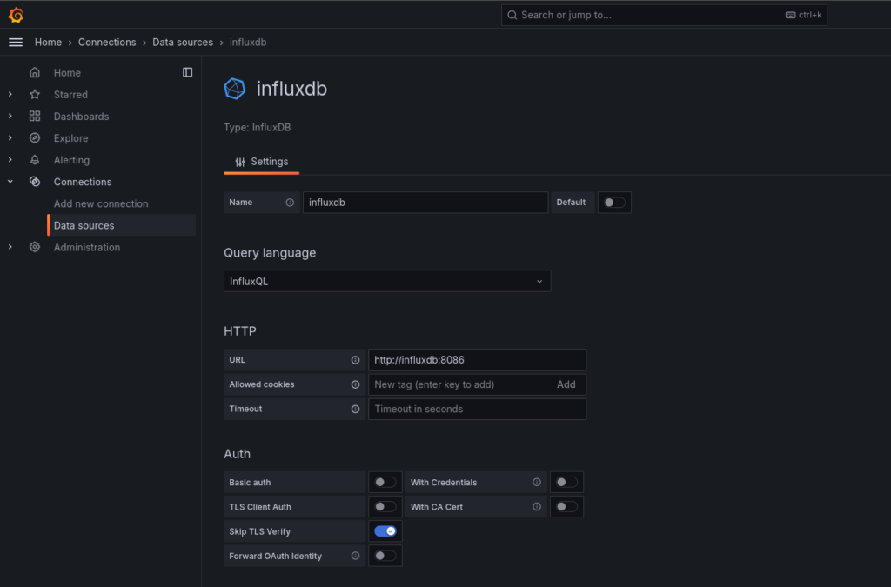

Since all 3 of these services are in the same Docker compose file we can use the Docker DNS hostname in the URL section sending in the port 8086. My initial setup is an unecryped HTTP connection so the only Auth option I'll have selected is 'Skip TLS Verify'.

For the InfluxDB Details, I'm going to be starting with my Proxmox bucket. For Database I added the name of the initial bucket we created earlier. My username and the password is the key we saved earlier from the InfluxDB setup. When you click save and test you should get a message similar to the one below.

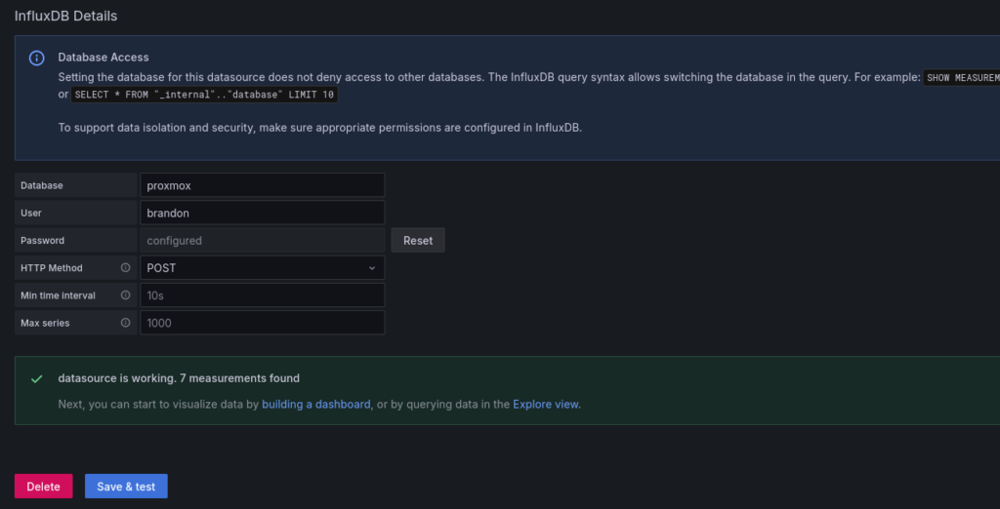

#### Optional Hosts Config

While you can use IP addresses for any machines that you want to monitor, it is again helpful to use names instead. If you already have some kind of internal DNS setup for your network, you can use those names. If not, you can also add entries to the hosts file at `/etc/hosts`.

```
sudo nano /etc/hosts
```

Below the default hostnames, I added some for local servers that I would like to use names for. To do this you simply add a new line with the local IP address followed by the name you'd like to use. You can also use additional local domains and extra names as shown in the unRAID example. A system reboot will be required to change host names.

```
# System Default
127.0.0.1 localhost
127.0.1.1 dockerlab

# Custom Hostnames
10.0.0.65 Nextcloud
10.0.0.90 unRAID unraid.local
10.0.0.218 proxmox
```

Now inside the Prometheus configuration, you can use that name. Here's an expanded example showing three targets for the node exporter including the new hostnames we just added:

```
- job_name: node_exporter
  static_configs:
    - targets:
      - dockerlab:9100
      - Nextcloud:9100
      - unRAID:9100
```

You can add as many machines as you want like this on new lines. Note that anytime you add another machine to the config you will need to restart the Prometheus container. The simplest way to do that in this case will be to restart the entire Docker Compose deployment, which is done in the directory with the compose file using the command below.

```
docker compose restart
```

##### Docker Compose Tips

Also, here are a couple quick tips for managing this deployment with Docker compose. If you ever want to bring the deployment down for any reason, use the down command.If you are having issue and want to view the logs from both the Grafana and Prometheus containers, run the logs command.

.stk-c78fa4c{margin-bottom:0px !important}

```
docker compose down
```

```
docker compose logs
```

#### Node Exporter Dashboard

Now let's set up the node exporter dashboard in Grafana. The good news is that there's an excellent premade dashboard available as a community submission to the Grafana library. That's actually true for many common use cases, as we'll see below. Building custom Grafana dashboards isn't something we'll cover in this guide, but it is totally possible.

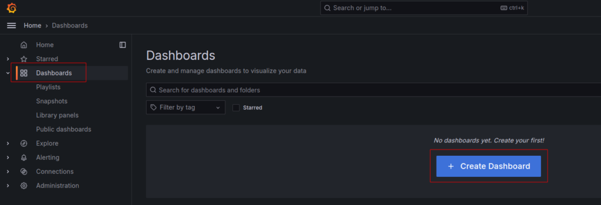

The Grafana interface has a few sections in the left side bar menu. Select _Dashboards_ and hit the _Create Dashboard_ button to create a new dashboard.

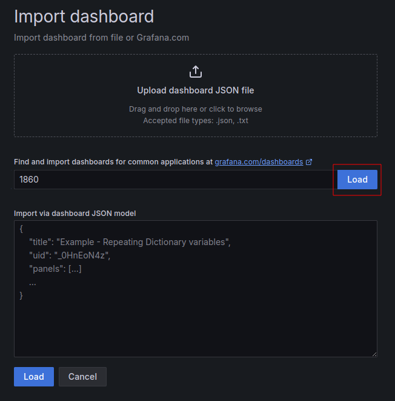

In this case we are importing a dashboard, so press _Import dashboard_. The dashboard we'll be importing is called _Node Exporter Full_. Grafana hosts a [library](https://grafana.com/grafana/dashboards/1860-node-exporter-full/) of dashboards that different people have shared, and _Node Exporter Full_ is on [this link](https://grafana.com/grafana/dashboards/1860-node-exporter-full/). To import the dashboard, enter the dashboard's number, 1860, or past the URL into the appropriate box and hit _Load_.

Name your dahbaord whatever you'd like and click the dropdown at the bottom that says _Select a Prometheus data source_ and select the default Prometheus. Then hit the import button to complete the import process.

You'll be taken directly to the dashboard, and it will be available to select later from the main dashboards page. If you already started up the node exporter service on one machine and everything is working properly, you should already see that machine in the _Host_ dropdown.


The gauges at the top should already be showing readings too. It will take a while though before you collect enough data for the charts below to be interesting.

Alright, so that's the basic setup. If you have multiple machines configured you can select them from the _Host_ dropdown. By default Grafana displays the last 24 hours of data, but you can change that by clicking on the date and time selector in the upper right.

There's a few convenient shortcuts, and you can also select precise date and time ranges using the fields on the left side. Click the calendar icons to select dates from a visual calendar, then hit the _Apply time range_ button to see just that data in the charts. You can also click and drag on any chart to zoom in on a specific time period.

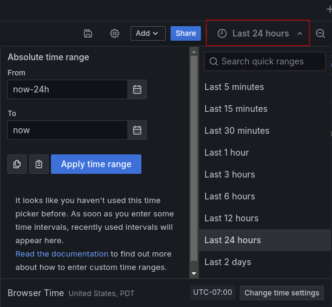

Beside the time range selector there is also a widget to set the auto refresh rate, as well as a button to refresh immediately. If you scroll down, you'll see more sections that can be expanded with graphs of different data. That pretty much sums it up for the important controls here on the dashboard page, but of course there's a lot more to Grafana for you to explore if you want, such as building custom dashboards.

#### unRAID and Prometheus Node Exporter

In the _Optional Hosts Config_ section above you can see that I added my unRAID server to both my hosts file as well as the Prometheus configuration under the node\_exporter job. Yet, we have not installed the node exporter on unRAID. Doing this is a very straight forward process.

Head over to the application page and search for 'prometheus node exporter' and install the plugin as show in the image below.

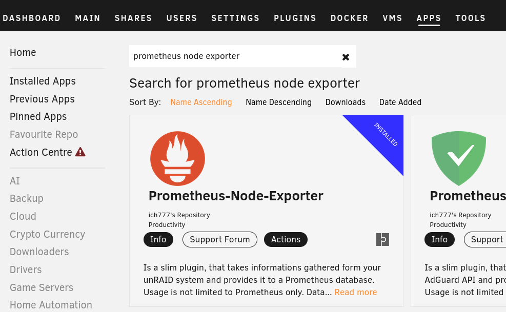

Once this is installed data will be available for Prometheus to collect. You may need to restart your containers to begin pulling data. Now in your existing Node Exporter dashboard you will see the new unRAID option under the hosts selection.


### Proxmox and InfluxDB Setup

Proxmox is one of the main platforms running on my home lab so gathering metrics and viewing them easily is critical. Thankfully, Proxmox has a build in exporter for InfluxDB. Above when we setup our web UI for InfluxDB we created an initial bucket for Proxmox. If you created a bucket for a different data set, now is a good time to make a bucket specifically for Proxmox.

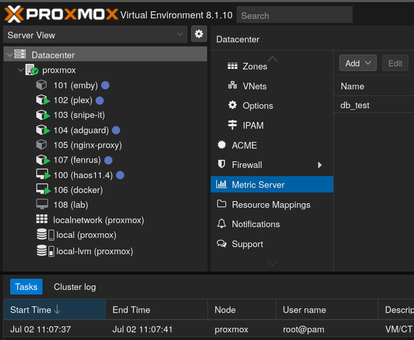

Once you have a bucket ready for Proxmox we can begin exporting metrics. To do this login to your Proxmox dashboard and click on 'Datacenter' in the top left. In the Datacenter menu scroll down until you find the 'Metrics Server' setting pane. When you click add there will be two different options. For our setup pick InfluxDB. Check the image below to see how I filled it out with my information. Server will be the IP of the machine InfluxDB is running on.


Be sure to use the token that was generated when setting up InfluxDB. If needed you can create new API keys within the InfluxDB web UI. Click on create and within a few minutes you will start to see data populate within your bucket. Now, we can use the connection we added eariler in Grafana with our Proxmox data to visualize the data. Follow the steps we used eariler to import a dashboard, but this time we will import the one labeled as [Proxmox](https://grafana.com/grafana/dashboards/10048-proxmox/) (10048) my personal favorite dashboard for Proxmox. Select the InfluxDB you created earlier as the data source and import. Once in select all your storage and interfaces, make any edits you need and you're good to go!

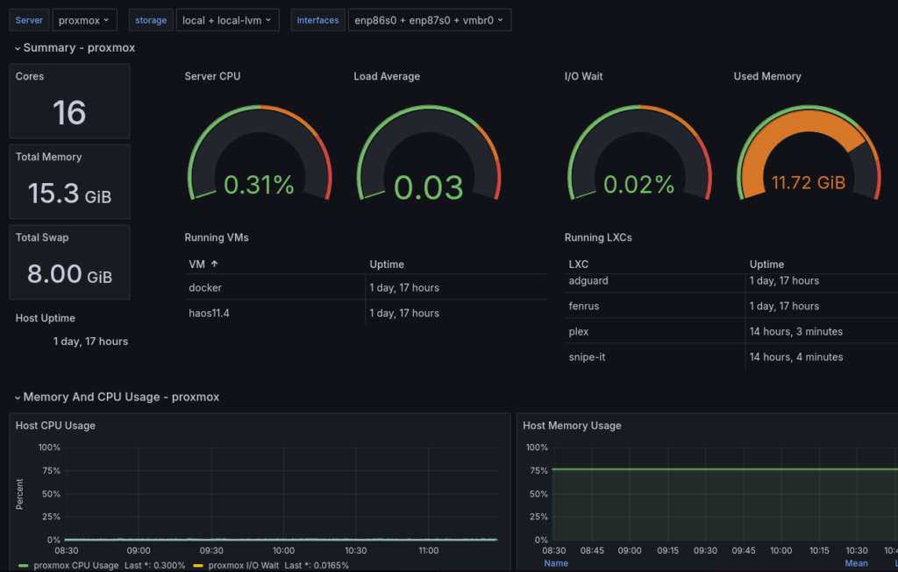

### Monitor Docker with Telegraf

For my setup I'm using Telegraf as a container to monitor Docker on this host system and any other systems with Docker containers. **I will note, I'm not necessarily using best practices for this in terms of security.** This container is running as privileged with access to the root file system of the machine. If you'd prefer you can remove this service from the docker compose file and come up with your own implementation.

First, create a new bucket specifically for docker on our host system. Later will will do this with a seperate machine running Unraid and link it to InfluxDB on our dockerlab machine. After you create a bucket for Docker head over to your Telegraf config in your project directory.

```
nano telegraf/telegraf.conf
```

You can see in my default configuration is setup only to monitor docker with some system monitoring [plugins](https://docs.influxdata.com/telegraf/v1/plugins/) commented out. I recommend you read up on their [documentation](https://docs.influxdata.com/telegraf/v1/get-started/) for plugin specific configuration. To monitor docker with the included configuration you'll only need to change the information under the outputs plugin to match your setup. You shouldn't need to change the URL since it's running in the same stack.

```
[[outputs.influxdb_v2]]
  urls = ["http://influxdb:8086"]
  token = "yourtoken"
  organization = "yourorg"
  bucket = "localbucket"
```

After you save your configuration restart docker compose and head over to your InfluxDB dashboard to see if it is gathering data from Telegraf. It may take a few for data to populate and you may need to log in and out of this dashboard. If everything is looking good we can import another dashboard in Grafana to monitor Docker!

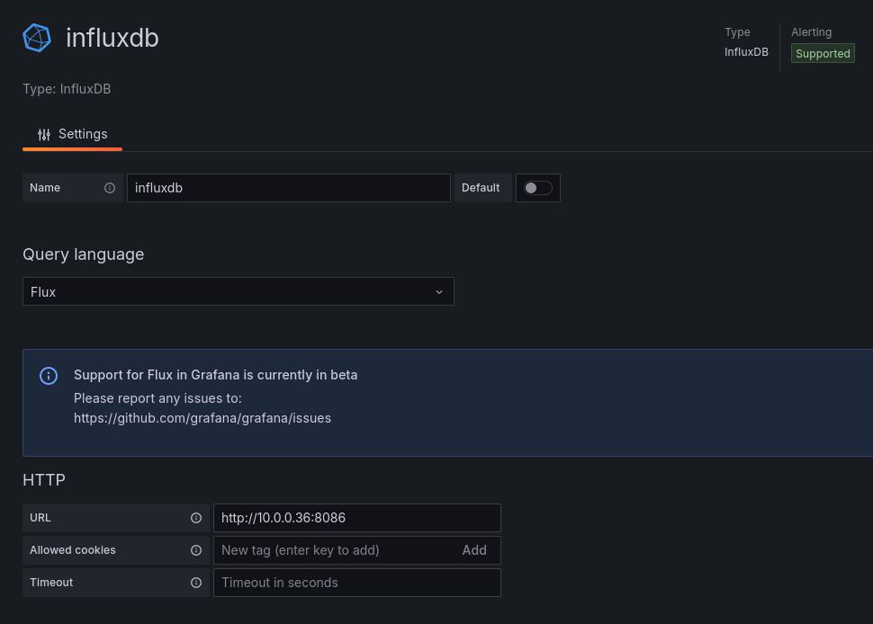

Since our InfluxDB Proxmox data is using InfluxQL we are going to want to create a new connection to the same InfluxDB instance, but this time using Flux. Our Docker dashboard supports Flux and this will allow use to visualize multiple buckets within a single dashboard. Similar to have having multiple instances of the Node Exporter in your configuration will show up. Change the name to something identifiable. I usually just match the bucket name.


After you add the data source we will be importing the [Docker Monitoring](https://grafana.com/grafana/dashboards/18389-influxdb-2-x-telegraf-docker-dashboard/) (18389) and selecting the new data we setup with Flux. Once the dashboard is imported select the bucket download and pick the bucket that has your Docker data!

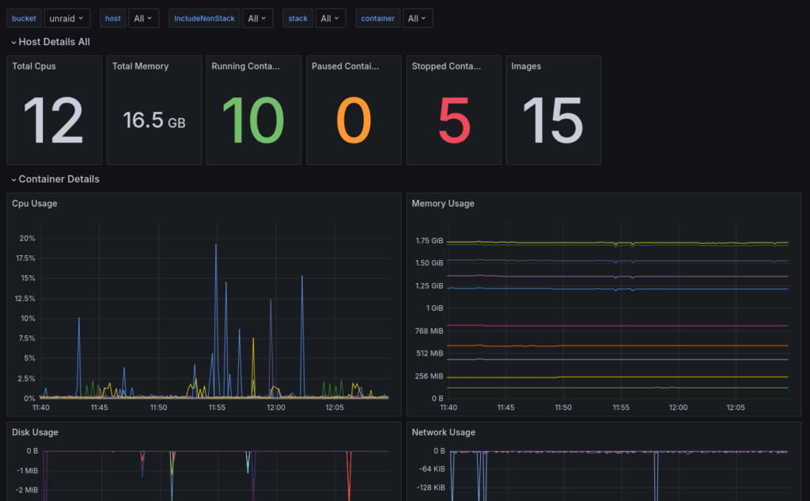

### Monitor Unraid with Telegraf

The whole reason I decided to fight with Telegraf to begin with is to get a very specific Unraid dashboard. Actually getting Unriad to work with Telegraf proved to be a very difficult endeavour. But, I got everything working! This article is already way to long so I outlined all the steps it took within the compainion Github repo for this article.


### server-monitoring/unraid at main · TechHutTV/server-monitoring

Docker compose featuring Grafana, Prometheus, and Influxdb2 - TechHutTV/server-monitoring

Was it all worth it? I think so, just look at that dashboard!

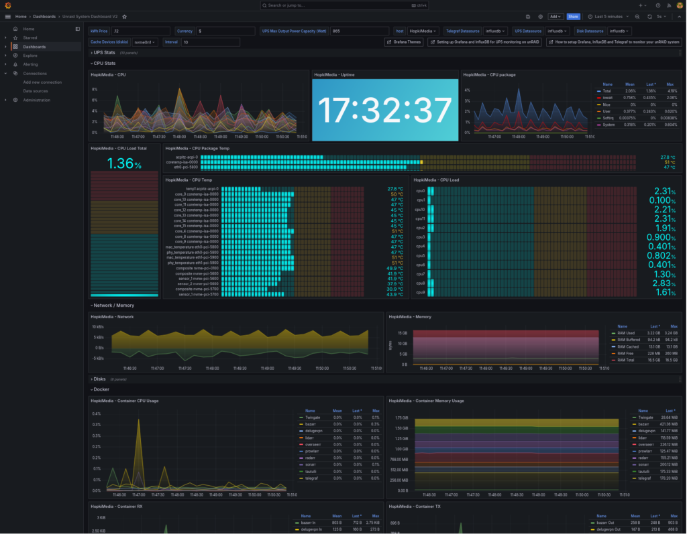

## Wrapping Up

With that, we have deployed and explored a self hosted system for monitoring any machines in your lab and beyond. While the set up is relatively straightforward, these are in fact industrial grade tools with a variety of use cases beyond what we covered today.

I hope that this setup will serve you well in understanding what's happening with the machines in your lab, and that you're feeling inspired to experiment and learn more about the world of monitoring and alerts. Have a beautiful day, and I'll see you next time.
